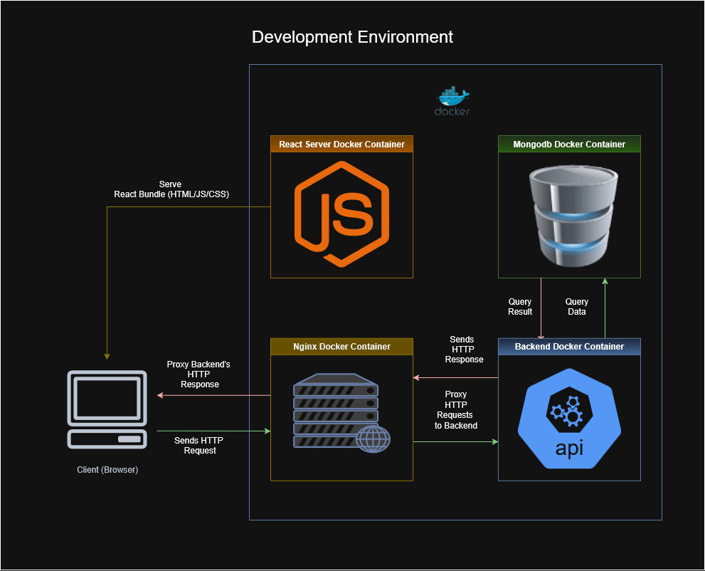

# MUSEngage
- A student engagement web portal.

# Development Environment Overview
 

# Prerequisites
- [Docker](https://docs.docker.com/compose/install/)
- [Node.js](https://nodejs.org/en/download) (optional: if docker is taking too long to install node modules)
- [Python3](https://www.python.org/downloads/) (optional: useful for the backend codebase)

# Project File Structure:
```
├── backend
│   ├── dockerfile - dockerfile config
│   ├── /env - python environment. You have to generate this yourself.
│   ├── /nginx - contains the nginx.conf config file
│   ├── requirements.txt - python environment packages and depencies
│   └── /src - backend source files
├── compose.yaml - docker container config file
├── frontend
│   ├── /node_modules - iykyk. node docker container generates this during docker compose.
│   ├── package-lock.json - node packages snapshot, used on `npm ci` (clean install). 
│   ├── package.json - node packages snapshot, used on npm install
│   ├── /public - public access assets
│   └── /src - frontend soure files
└── LICENSE
```

# Python venv
- If you want your LSP to work properly. Create a virtual environment and Install the python packages.
```
$ cd /MUSEngage/backend
$ python -m venv env
$ source /env/bin/activate
$ pip install -r requirements.txt

```

# Database
- Choose either a Local Mongodb Database, or Cloud-hosted MongoDB service in the .env file. Remove/Comment the one you dont want inside the ./env file and also in the compose.yaml file. Remove or comment out the mongo container  in the compose.yaml file, if using the Cloud-hosted DB. 

## backend components
- Nginx -  Reverse Proxy, proxies requests made from the web app's http client 
  and to the backend api port "backend:3000" docker container.
- FastAPI - a Python backend API to handles client requests and manages data 
  into the database or retrieve data from it.
- Mongodb - NoSQL document-oriented database.
- Strife API - Third-party online payment service. Used for handling checkout.
- Gemini API - API Request to Google's Gemini's AI. Used for handling content moderation.

## Frontend components
- React - Javascript Library for creating the UI of the app. React components handles states.
- Axios - Http client to make requests into our backend api (FastAPI).
- Vite  - Frontend Build tool and development server.
- Material UI - frontend UI library.

## Analytics dashboard
- `/analytics` (admin only) provides an interactive engagement dashboard with privacy-first metrics, responsive charts and CSV/PDF export options.
- Chart visualisations use responsive SVG components tailored for the dashboard so they work across desktop and mobile breakpoints.
- Time period selector supports the current month, trailing three/six/twelve months, and custom month ranges.

### Analytics API
- `GET /api/analytics/dashboard`
  - Query parameters:
    - `range` (optional): one of `current_month`, `past_3_months`, `past_6_months`, `past_year`, or `custom`.
    - `startMonth`/`endMonth` (optional, `YYYY-MM` format): required when `range=custom`.
  - Response: aggregated counts only (events, RSVPs, active users, tag popularity, monthly time-series, category distribution, event creation trends, user growth, and popular days/hours).
  - Access: admin users only. Results are cached in-memory for 5 minutes to reduce database load.


## Docker
- Docker runs 4 containers (1 out of the 4 containers is optional).
  - frontend: contains node.js
  - backend: our backend API server, a python script in "/backend/src/server.py".
  - nginx: reverse proxy, to forward http client request to the backend container. 
  - mongo: local database. (optional if not using the cloud hosted service).

| Container Name   | Port    | Container Port    |
|--------------- | --------------- | ---------------
| frontend   | 3000   | 3000   |
| backend   | 8001   | 3001   |
| nginx   | 8000   | 80   |
| mongo   | 27017   | 27017   |

- For more info, check the compose.yaml file.

## Secrets
- `SENDER_EMAIL`: Email address used to send OTP authentication messages. Configure this with the mailbox you control instead of leaving the hard-coded value in `backend/src/EmailOTP.py`.
- `SENDER_PASSWORD`: App-specific password for the sender mailbox. This must not be committed to source control; load it from the environment for the SMTP login in `backend/src/EmailOTP.py`.
- `GOOGLE_API_KEY`: Gemini API key required by the moderation client in `backend/src/ModeratorAI.py`.
- `STRIPE_SECRET_KEY`: Private Stripe API key consumed in `backend/src/server.py`.
- `BLOB_CONNECTION_STRING`: Azure Blob Storage connection string needed for file uploads in `backend/src/server.py`.
- `AZURE_EMBEDDING_KEY`: Azure AI embedding key referenced in `backend/src/server.py`; replace the committed placeholder value.
- `MONGO_INITDB_ROOT_USERNAME` / `MONGO_INITDB_ROOT_PASSWORD`: Credentials for the local MongoDB instance configured in `compose.yaml`; override the defaults before deploying.

## Security hardening highlights
- **Rate limiting** is enforced via SlowAPI with Redis support. Key endpoints:
  - `/api/otp/request`: 3 requests / 5 minutes per IP
  - `/api/otp/verify`: 5 attempts / 15 minutes per IP
  - `/api/users/check_credentials`: 5 attempts / 15 minutes per IP
  - `/api/auth/register`: 3 requests / hour per IP
  - `/api/upload`: 10 uploads / hour per authenticated user
  - All other API routes default to 100 requests / 15 minutes per IP.
- **Account lockout** disables authentication after five consecutive failures for 30 minutes. Locked users receive an email notification and admins can unlock accounts via `POST /api/admin/unlock-account/{user_id}`.
- **OTP improvements**: 8-character alphanumeric codes (excluding ambiguous characters) valid for five minutes with single-use verification and brute-force tracking.
- **Password policy**: minimum 12 characters with upper/lower case letters, a digit, and a special character. Common passwords are rejected and hashes use bcrypt with a configurable cost factor (`BCRYPT_ROUNDS`, default 14).
- **Email verification**: only addresses matching `12345678@student.murdoch.edu.au` may register. Users receive verification links and must confirm before logging in. A resend endpoint and `/verify-email` UI assist recovery.
- **File uploads**: restricted to images (JPG/PNG/GIF/WebP), maximum 10 MB, with magic-number validation, dimension checks (≤4096×4096), filename sanitisation, and security headers.
- **CSRF protection**: tokens issued via `/api/csrf-token`, stored in secure cookies, and validated for all state-changing operations. Axios automatically includes the `X-CSRF-Token` header.
- **Security headers**: responses include HSTS (HTTPS only), CSP, X-Frame-Options, X-Content-Type-Options, X-XSS-Protection, Referrer-Policy, and Permissions-Policy.

# How to run?
- Install [Docker Compose.](https://docs.docker.com/compose/install/)
- git clone this repo `git clone https://github.com/Aithusa712/MUSEngage.git`
- cd to project folder `cd MUSEngage`
- run `docker-compose up --build` (if it hangs do not panic, you have to install the `node_modules` manually running npm install in the `/frontend` directory. The reason is stated in known issues)
- open localhost:8000 in your browser.

# TODO:
- Integrate my Gemini API request script for student posts creation.
- Student/community posts components.
- PASS page.
- MurdochEvent component.
- Shop component.
- Checkout component.
- Dashboard component (after all the components stated above are finished).

# TODO: (hard mode)
- AI personalization for dashboard (maybe train a content based recommendation system? idk)
- Offline mode

# Known issues:
- npm ci/npm install inside the docker contianer can take hours
  to install the node_modules. To avoid this, before running the docker 
  containers, install the node modules beforehand by cd-ing to the `/frontend` 
  folder and running `npm install`. This requires your OS to have node 
  installed. (update: Apparantly docker just hates my laptop, it should work normally.)


